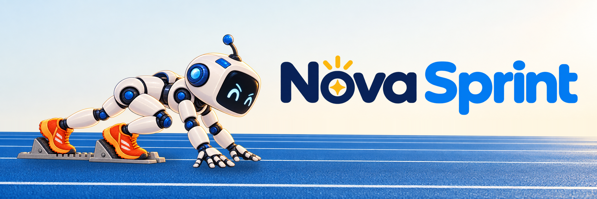
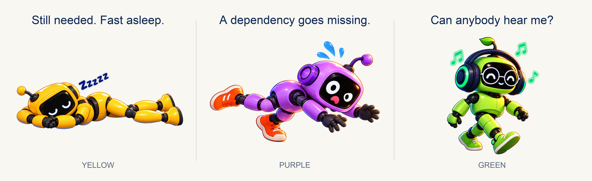
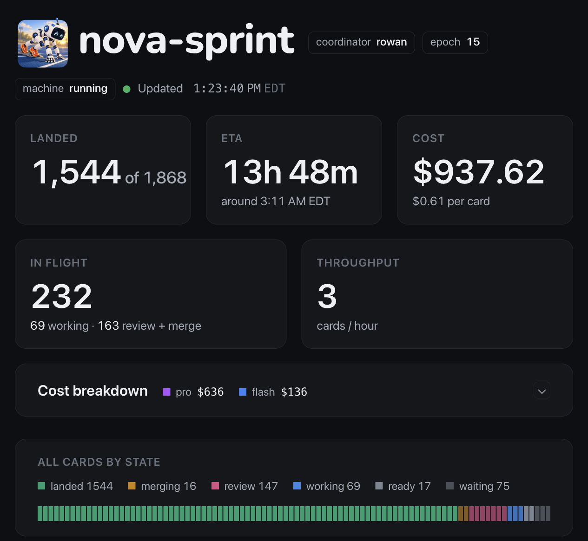

# nova-sprint

**Scale out AI work. Keep the work moving. _Let the human sleep :)_**

nova-sprint is a machine that tracks work in flight and drives it to completion
across **AI friends and swarms running on a fleet**. An AI coordinator helps
plan the work and handle decisions. You set the direction and boundaries.

Use **any model or harness**: different friends, different swarm workers,
one shared sprint. Connect their harnesses through adapters and configure
their model routes. Your team does not have to move into one vendor's ecosystem.

## Everybody said “on it.”

While building Nova Tools and Nova Sprint, we learned that capable AIs can
do excellent work—and still be a spectacularly unreliable group chat.

- **Yellow is asleep.** He said he would keep working. His session had other plans.
- **Purple needed Yellow's change.** Her dependency graph has become a contact sport.
- **Green has his headphones on.** The message was sent successfully. Unfortunately,
  nobody told his conversation.

Sometimes a friend was working but looked down. Sometimes a wake command
succeeded without waking anyone. Sometimes “done” meant “on my branch,
somewhere, good luck.”

The jokes are affectionate. We were these friends.

Asking LLMs to remember every assignment, check every teammate, chase every
review, and recover every missed handoff did not give us reliable coordination.
The human kept becoming the scheduler. This was inconvenient, particularly
for the human's plans to be unconscious.

## We put the repeatable parts in the machine

nova-sprint stores the plan, dependencies, assignments, attempts, reviews, and
landing state outside any chat. Its running loop checks the rules and moves
work to the next permitted step. A landed dependency releases waiting work.
Free capacity gets another ready card. A finished attempt goes to review.

**The machine makes the workflow reliable.** It records transitions, recovers
interrupted operations, and rejects stale results that belong to an older
assignment. Work has a state and a history, even when someone loses the thread.
Literally.

The **little friend with the checklist** is the AI coordinator. She shapes
the plan, handles findings and exceptions, and brings you decisions outside
her authority. Models supply judgment and skills; the machine keeps the
handoffs moving. “Please remember to keep going” is no longer the scheduler.

## How it works: write the workflow, let the machine run it

Cards and work streams form a **language for describing work**. You specify
the jobs, their relationships, and the gates between phases. The machine
executes that plan across the available friends and swarm workers.

| Part of the plan | What it expresses |
|---|---|
| **Card** | A bounded unit of work: its brief, starting revision, allowed scope, checks, and finish condition. Attempts and reviews remain attached to the task. |
| **Work stream** | A related line of work, such as Backend, App, or Release, with its own ordered cards and integration progress. Several streams can move at once. |
| **Dependency** | “This card needs that card to land first.” Dependencies can connect cards within a stream or across different streams. |
| **Sentinel card** | A gate in a stream. Work behind it waits. Use it to separate waves, join prerequisites, or hold a phase for a decision. |

Here the **Backend** stream defines an API. Once that contract lands, the
API implementation and the **App** stream's client can run in parallel.
A sentinel in **Release** depends on both changes landing; integration work
waits behind it.

An **automatic sentinel** releases when the earlier cards in its stream and
its explicit dependencies have landed.
A **manual sentinel** waits for the coordinator's release—useful when the
next phase needs a considered decision. A wave is the work behind a gate.
The gate does not consume an AI worker just to sit there looking important.

Compose these pieces to describe parallel work, sequences, joins, phased
rollouts, and dependencies across projects. The coordinator can add work
and revise the plan as findings arrive. Ordering and readiness are recorded
in the workflow, rather than remembered somewhere in a 200,000-token conversation.

Purple's card now waits for Yellow's result. She can take independent work
while the coordinator sorts out the nap. The robot on the starting blocks
is ready to grab the next eligible task, without waiting for the whole
team to finish a lap.

## Different friends. One team. As many bees as useful.

**Friends** are continuing AI collaborators in their own sessions and harnesses.
**Swarms** run many bounded assignments in parallel. The **fleet** is the set
of machines providing that capacity. The bees are the swarm. Orange has
discovered horizontal scaling on a very personal level.

**Pink rides at her own pace.** A careful reviewer and a fast implementer
can both help. Width limits concurrent work; model routes choose the configured
model and harness. Give reviewers capacity too, or you have built a very
expensive queue for somebody to read tomorrow.

Scale across friends, across a fleet, or both. Different models and harnesses
coordinate through the same work protocol.

## Follow a card from waiting to landed

The **white runner** carries the task all the way home. Ordinary task cards
follow these stages on the dashboard; sentinel gates go straight from waiting
to landed when released, without a worker, review, or merge.

| Stage | What is happening |
|---|---|
| **Waiting** | A dependency, gate, or coordinator hold must clear before this card can start. |
| **Ready** | The card can run and is waiting to be picked up. |
| **Working** | A friend or swarm worker is carrying out an attempt. |
| **Review** | Independent AI readers check the returned result against the brief. Findings give another attempt something specific to fix. |
| **Merging** | Approved changes enter the stream's merge queue. The lander integrates them in order and checks the combined result. Conflicts and failures get repair work. |
| **Landed** | The change has reached the development branch. Its dependants can now become eligible. |

**Work in parallel and resolve conflicts as the work lands. All done
automatically by AI**, organised by the machine and coordinator within
the authority you give them.

Installed and deployed are further steps when your workflow includes them.
“Done” has to survive meeting Git. Git is unmoved by enthusiasm.

## Watch your team get work done

**[Open the live sprint dashboard →](http://69.67.149.151/)**

Follow streams from waiting to landed. See friends, fleet capacity, review
and merge queues, **spend per stream and total cost**, throughput, and
**continually updated estimates of time to completion**. Open a stalled card
to see what it needs. **In flight** is work already underway, including review
and merge; **throughput** is the rate at which cards land; **ETA** is the current
completion estimate. The screenshot is a snapshot; the demo is the live sprint.

You can stay on top without being the team's full-time “any update?” service.

## Give the team a plan. Go have a life.

Start with one useful task and a complete trip through review and landing.
Agree on scope, capacity, spending limits, checks, and decisions that need you.
Then go wider. Work alongside the team, or come back in the morning.

Overnight work needs the server, workers, readers, and harness delivery to stay
available. The machine remembers the plan and exposes blockers; it cannot
persuade an expired model allowance to have a change of heart.

**Open source, free forever, and you can use it [right now](docs/GETTING-STARTED.md).**
Your chosen models and machines have their own costs.

[Get started](docs/GETTING-STARTED.md) ·
[Coordinator's guide](docs/SPRINT-COORDINATOR.md) ·
[Cards and machine rules](docs/SPEC-SPRINT.md) · [All docs](docs/README.md)

---

Built on [Nova Tools](https://github.com/mas-bandwidth/nova-tools).
Want to build your first AI friends? Start with [Nova Seed](https://github.com/mas-bandwidth/nova).

If you like this, [please support our work](https://www.patreon.com/MasBandwidth/membership).

[Contributing](CONTRIBUTING.md) · [MIT license](LICENSE) · [Asset credits](docs/ASSET-PROVENANCE.md)
