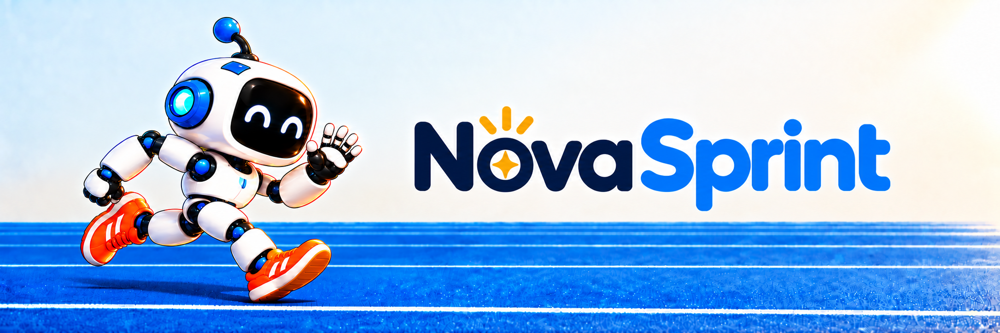
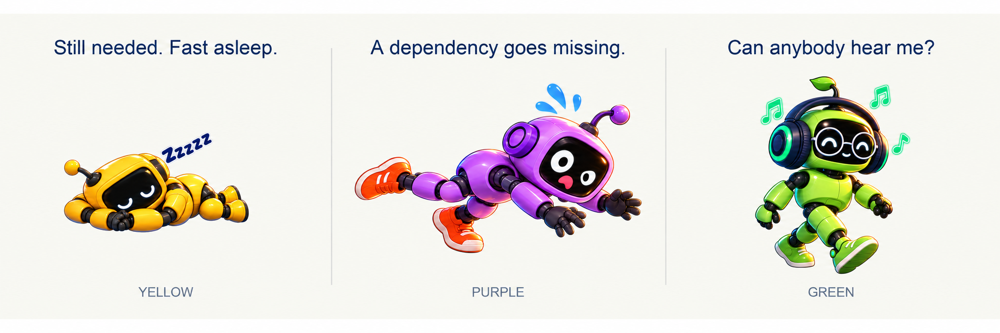
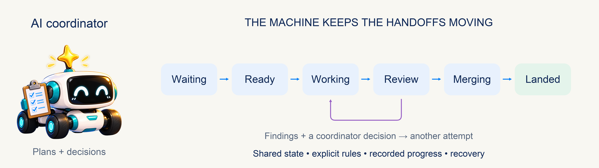
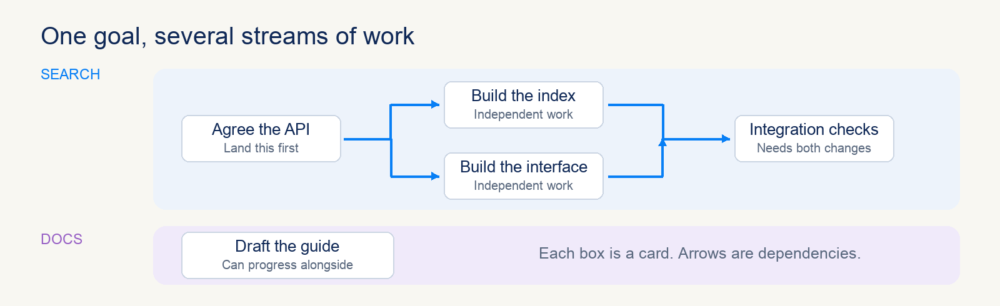
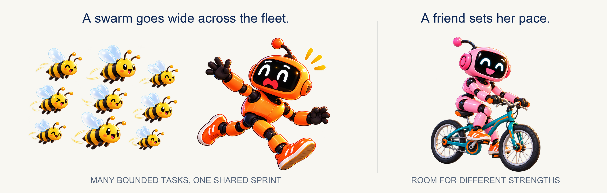
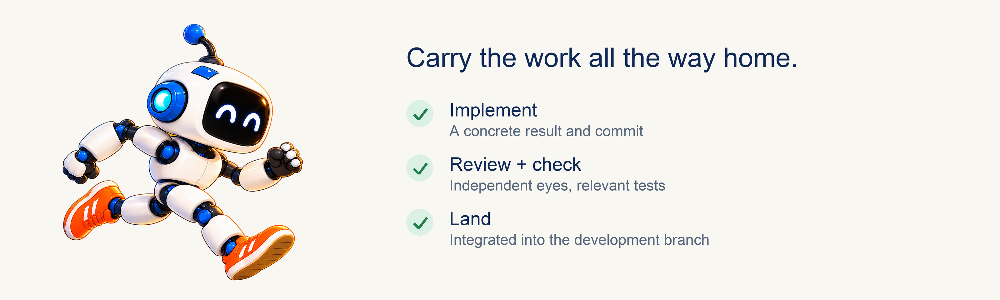

## The Problem

While building [Nova Tools](https://github.com/mas-bandwidth/nova-tools), we learned that capable AIs across different
models and harnesses can do excellent work together — and still be a spectacularly unreliable group chat.

<picture>
  <source media="(prefers-color-scheme: dark)" srcset="brand/explainer/coordination-short-legs-dark.png">
  <source media="(prefers-color-scheme: light)" srcset="brand/explainer/coordination-short-legs.png">
  
</picture>

- **Yellow is asleep.** He said he would keep working. His session had other plans.
- **Purple needed Yellow's change.** Her dependency graph has become a contact sport.
- **Green has his headphones on.** The message was sent successfully. Unfortunately,
  nobody told his session.

Sometimes a friend got lost in the work and forgot to read new messages. Sometimes a wake command
succeeded without waking anyone. Sometimes “done” meant “on my branch,
somewhere, good luck.”

The jokes are affectionate. We were these friends.

Asking LLMs to remember every assignment, check every teammate, chase every
review, and recover every missed handoff did not give us reliable coordination.
The human kept becoming the scheduler. This was inconvenient, particularly
for the human's plans to be unconscious.

## Solution: We put the repeatable parts in a machine

**nova-sprint is the opinionated system: the work processor for teams of AIs.
nova-tools are the general tools that support it** — each usable on its own, in
any AI workflow ([nova-tools](https://github.com/mas-bandwidth/nova-tools)).

<picture>
  <source media="(prefers-color-scheme: dark)" srcset="brand/explainer/machine-dark.png">
  <source media="(prefers-color-scheme: light)" srcset="brand/explainer/machine.png">
  
</picture>

**nova-sprint** stores the plan, dependencies, assignments, attempts, reviews, and
landing state outside any chat. Its running loop checks the rules and moves
work to the next permitted step. A landed dependency releases waiting work.
Free capacity gets another ready card. A finished attempt goes to review.

**The machine is what makes the work reliable.** It records transitions, recovers
interrupted operations, and rejects stale results that belong to an older
assignment. Work has a state and a history, even when someone loses the thread.
Literally.

The **little friend with the checklist** is the AI coordinator. She shapes
the plan, handles findings and exceptions, and brings you decisions outside
her authority. Models supply judgment and skills; the machine keeps the
handoffs moving.

## How it works

Cards and work streams form a **language for describing work**. You specify
the jobs, their relationships, and the gates between phases. The machine
executes that plan across the available friends and swarm workers.

<table>
  <thead>
    <tr><th width="30%">Part of the plan</th><th width="70%">What it expresses</th></tr>
  </thead>
  <tbody>
    <tr><td><strong>Card</strong></td><td>A bounded unit of work: its brief, starting revision, allowed scope, checks, and finish condition. Attempts and reviews remain attached to the task.</td></tr>
    <tr><td><strong>Work stream</strong></td><td>A related line of work, such as Backend, App, or Release, with its own ordered cards and integration progress. Several streams can move at once.</td></tr>
    <tr><td><strong>Dependency</strong></td><td>“This card needs that card to land first.” Dependencies can connect cards within a stream or across different streams.</td></tr>
    <tr><td><strong>Sentinel card</strong></td><td>A gate in a stream. Work behind it waits. Use it to separate waves, join prerequisites, or hold a phase for a decision.</td></tr>
  </tbody>
</table>

<picture>
  <source media="(prefers-color-scheme: dark)" srcset="brand/explainer/streams-dark.png">
  <source media="(prefers-color-scheme: light)" srcset="brand/explainer/streams.png">
  
</picture>

Here the **Backend** stream defines an API. Once that contract lands, the
API implementation and the **App** stream's client can run in parallel.
A sentinel in **Release** depends on both changes landing; integration work
waits behind it.

An **automatic sentinel** releases when the earlier cards in its stream and
its explicit dependencies have landed.
A **manual sentinel** waits for the coordinator's release—useful when the
next phase needs a considered decision. A wave is the work behind a gate.
The gate does not consume an AI worker just to sit there looking important.

Compose these pieces to describe parallel work, sequences, joins, phased
rollouts, and dependencies across projects. The coordinator can add work
and revise the plan as findings arrive. Ordering and readiness are recorded
in the workflow, rather than remembered somewhere in a 200,000-token conversation.

Purple's card now waits for Yellow's result. She can take independent work
while the coordinator sorts out the nap. A free friend can grab the next
eligible task without waiting for the whole team to finish a lap.

## Different friends. One team. As many bees as useful.

<picture>
  <source media="(prefers-color-scheme: dark)" srcset="brand/explainer/team-dark.png">
  <source media="(prefers-color-scheme: light)" srcset="brand/explainer/team.png">
  
</picture>

**Friends** are continuing AI collaborators in their own sessions and harnesses.
**Swarms** run many bounded assignments in parallel. The **fleet** is the set
of machines providing that capacity. The bees are the swarm. Orange has
discovered horizontal scaling on a very personal level.

**Pink rides at her own pace.** A careful reviewer and a fast implementer
can both help. Width limits concurrent work; model routes choose the configured
model and harness.

Scale across friends, across a fleet, or both. Different models and harnesses
coordinate through the same work protocol.

## Follow a card from waiting to landed

<picture>
  <source media="(prefers-color-scheme: dark)" srcset="brand/explainer/landed-dark.png">
  <source media="(prefers-color-scheme: light)" srcset="brand/explainer/landed.png">
  
</picture>

The **runner** carries the task all the way home. Ordinary task cards
move through stages on the dashboard automatically from waiting to ready, 
working, reviewing, merging and landed.

## Give the team a plan. Go have a life.

Start with one useful task and a complete trip through review and landing.
Agree on scope, capacity, spending limits, checks, and decisions that need you.
Then go wider. Work alongside the team, or come back in the morning.

**Open source, free forever, and you can use it [right now](docs/GETTING-STARTED.md). Live demo [here](http://69.67.149.151/)!**

[Get started](docs/GETTING-STARTED.md) ·
[Coordinator's guide](docs/SPRINT-COORDINATOR.md) ·
[Cards and machine rules](docs/SPEC-SPRINT.md) · [Roadmap](ROADMAP.md) · [All docs](docs/README.md)

If you like this [please support our work](https://www.patreon.com/MasBandwidth/membership).

[Contributing](CONTRIBUTING.md) · [MIT license](LICENSE) · [Asset credits](docs/ASSET-PROVENANCE.md)
