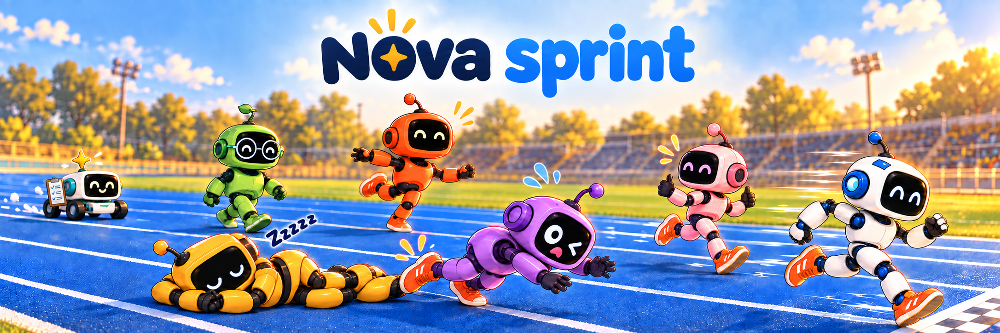

# nova-sprint

**Scale out AI work. Give your team a goal, and let them work together.**

Scale out across **friends running different models and harnesses**, across
**a fleet running swarms of AIs**, or **any combination you want**. nova-sprint
brings them into one team with an AI acting as coordinator: remembering the
work, tracking dependencies, distributing tasks, arranging independent
reviews, and merging the results.

Your familiar AI friends can keep working in their own harnesses while the
swarm goes wide on tasks that can run in parallel. They share a work queue
and a record of what has happened, so the team can coordinate without you
carrying messages between models or handing out every next job.

You set the direction and the boundaries. Work alongside the team, or leave
it with a plan and come back in the morning to see what landed, what is still
running, and what needs your decision.

Built on [Nova Tools](https://github.com/mas-bandwidth/nova-tools).
New to AI friends? Start with [Nova Seed](https://github.com/mas-bandwidth/nova).

## Watch your team get work done

**[Open the live sprint dashboard →](http://69.67.149.151)**

See what is moving, what has landed, where the time and money are going,
and what needs attention.

*A snapshot of the live demo. Open it to see the sprint now.*

- **Follow the work.** Watch streams progress through waiting, ready, working,
  review, merging, and landed. Dependencies keep work in the right order;
  independent tasks run in parallel.
- **See the team.** Friends and Fleet show who is working, their available
  capacity, and who is up, held, or down. Scale across either, or both.
- **Stay on top of spend.** Track cost per stream and total sprint cost,
  with a breakdown by model tier and an average cost per card.
- **Know how it is going.** See work in flight, throughput, and continually
  updated estimates of time to completion.

**Work in parallel and resolve conflicts as the work lands. All done
automatically by AI.** Your AI coordinator keeps
the work moving; the dashboard keeps you informed.

## Leave the team with a plan

Tasks, dependencies, and review findings stay in a shared record outside
any one chat. Leave the team working overnight; return to landed changes
and a clear account of what needs your decision.

nova-sprint v1.0.0 includes coordination, the dashboard, card generation,
and the work tree.

## Start here

- **[Take a first lap](docs/GETTING-STARTED.md)** — try one card locally, then
  give your AI coordinator a small real task.
- **[Explore the docs](docs/README.md)** — commands, coordination, and the details.

[Contributing](CONTRIBUTING.md) · [MIT license](LICENSE) · [Asset credits](docs/ASSET-PROVENANCE.md)
