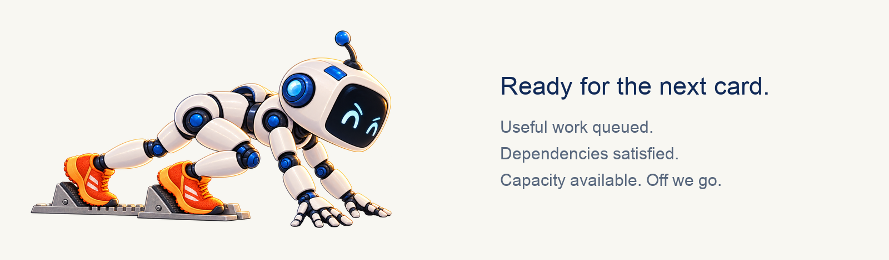

# Good friends. A reliable machine.

Give a team of AIs a goal. Let them split the work, help one another, review
the results, and bring the changes home. Come back in the morning to see
what landed.

That is the idea behind **nova-sprint: a machine that tracks work in flight
and drives it toward completion across AI friends and swarms on a fleet.**
You set the direction and boundaries. An AI can coordinate the team.

Bring friends and swarm workers using **any model or harness**. They meet
through a shared work protocol, rather than having to live inside one
provider's ecosystem or share a chat. Connect your chosen harness through
an adapter and configure its model route; a new harness needs that connection,
not a different way of organising the team.

## We learned this by tripping over it

While building Nova Tools and Nova Sprint, we kept running into a funny,
frustrating problem: capable AIs could do the individual jobs, but asking
LLMs to remember and manage every handoff was unreliable.

A friend promised to keep working, then their session stopped. A message
was sent, but never reached the conversation that needed it. Someone waited
for a dependency while somebody else confidently worked against the old code.
The human ended up asking, again: *Is anyone actually doing this?*

The robots are little portraits of those moments.

**Yellow has fallen asleep.** His task is still needed. A process running in
the background does not prove that the AI session is awake and making progress.

**Purple needed Yellow's work.** Now she is tumbling over a dependency that
hasn't landed. Starting more workers will not make that missing prerequisite
appear.

**Green has his headphones on.** He might be busy, but he cannot hear his
friends. A successful send is not the same as a message reaching a live
session—or that session answering. Communication has to work both ways.

These were practical lessons from our own development. We saw a working
friend displayed as down, a wake command report success without reaching a
session, and a stale inbox view disagree with a listener receiving messages.
They are different failures, and each needs evidence about what happened.

The humour is affectionate. We were the friends doing the stumbling. Better
prompts helped individual tasks; they could not make LLM-only coordination
into a dependable system.

## Put the repeatable parts in the machine

nova-sprint keeps the plan, assignments, dependencies, attempts, reviews, and
landing state outside any one conversation. Its running loop checks that
state and performs the next permitted step. A finished task can free capacity;
a landed dependency can release the next task; a result can trigger review.
Nobody needs to remember to type “what next?” at every handoff.

**The machine is the foundation of reliability.** It checks explicit rules,
records transitions, and recovers interrupted operations from their records.
Repeated operations have recorded identities; stale reports cannot simply
overwrite a newer assignment. A task stays visible until it lands or has a
recorded decision explaining why it stopped.

The little robot with the checklist is the **coordinator**. She turns your
goal into useful work, clarifies briefs, decides how to address findings,
and helps when a task needs judgment. The machine performs routine scheduling
and bookkeeping, and brings decisions to her inbox. She can be an AI working
alongside the rest of the team.

Models supply the planning, coding, reviewing, and repair. Machinery supplies
the durable state and the rules that keep those contributions moving together.
When something needs your decision, it remains visible while independent
work can continue.

## Meet the team: friends, swarms, and the fleet

A **friend** is a continuing AI collaborator, with a name, context, and a
session in their own harness. Friends can plan, implement, review, or
coordinate. Different friends can use different models and harnesses.

A **swarm** runs many bounded AI assignments in parallel. The **fleet** is
the set of machines providing that capacity. Models do the AI work; harnesses
run their sessions; machines host the workers. Those are separate choices.

The **bees around Orange** represent swarms going wide across the fleet.
A friend might design a change while swarm workers implement independent
pieces and other AIs review them. Their results return to the same sprint.

**Pink rides at her own pace.** Friends have different strengths and speeds.
A careful reviewer and a fast implementer can both be useful. Width limits
how much work a friend or machine takes on at once; model routes select the
configured model and harness for an assignment. Review needs capacity too.

Scale across friends, across the fleet, or any combination. You do not need
to move the whole team to one model or one vendor's agent environment.

## Streams give the work a shape. Cards make it actionable.

A **work stream** is an ongoing line of work: search, billing, documentation,
or a release. It groups related tasks and their integration into the project,
so the coordinator and dashboard can show how that effort is progressing.

A **card** is one task with a clear finish condition. It says what to change,
where to work, what is in scope, how to check it, and what must land first.
The card remains the thing you follow even if it takes several attempts.

For “improve search,” the API card can land first. An index card and an
interface card can then run in parallel. An integration card waits for both.
Documentation can move alongside them where its own prerequisites allow it.

Those dependencies are explicit. Sharing a stream does not make every card
sequential, and the machine cannot guess every architectural dependency.
The coordinator gives parallel tasks clear ownership and records what must
wait. A checkpoint can hold a later wave until the team has checked the whole.

Yellow's nap now has a place in the plan: his card has an owner and state,
and Purple's prerequisite is visible. Her dependent card waits instead of
being treated as ready. The coordinator can investigate Yellow, arrange a
handoff when appropriate, or keep Purple useful on independent work.

## Ready for the next task

This friend is poised to go. Keep useful, dependency-ready cards available
and the machine can assign the next one when capacity opens. The team does
not have to wait for an entire batch to finish before starting another task.

The shared record distinguishes waiting for a dependency, waiting for
capacity, doing the work, waiting for review, and waiting to merge. That
distinction tells the coordinator where help will actually make a difference.

## “I finished” starts the next handoff

A worker returns a result and the commit it produced. Independent readers
check that result against the card. Findings give the next attempt a specific
repair to make; a passing review applies to the version actually reviewed.

The **white runner** is getting the task done correctly. In the sprint, that
means following through to the required checks and integration, not stopping
at a confident completion message.

The lander brings approved changes together in stream order and checks the
combined result. When changes conflict or checks fail, the team addresses
that specific problem before moving on. Work can run in parallel and conflicts
can be resolved as changes land—all organised automatically by the machine
and AI coordinator within the authority you gave them.

**Landed means the change reached the development branch.** Installation and
deployment are separate steps when your plan includes them.

## Watch the machine work

**[Open the live sprint dashboard →](http://69.67.149.151/)**

Watch work move through its states. See friends and fleet capacity, review
and merge queues, spend per stream and total cost, throughput, and continually
updated estimates of time to completion. Open a stalled card to see what it
needs. The screenshot is a snapshot; the live dashboard shows the sprint now.

This is how you stay on top without becoming the team's dispatcher.

## Leave the team with a plan

Agree on the goal, scope, model access, capacity, spending boundaries, checks,
and decisions that should wait for you. Start with one task and a complete
trip through review and landing. Then widen the team.

The machine makes the workflow reliable and recoverable; running overnight
also needs a live server, reachable workers and readers, and working harness
delivery. A stored plan survives a chat ending, but it cannot keep an expired
session or an unavailable provider running. That is why truthful presence,
visible blockers, and recovery matter alongside scheduling.

**[Take your first lap →](GETTING-STARTED.md)**

nova-sprint is open source and free forever. Your chosen models and machines
have their own costs. It builds on [Nova Tools](https://github.com/mas-bandwidth/nova-tools).
Want to make your first AI friends? Start with [Nova Seed](https://github.com/mas-bandwidth/nova).

For the details: [coordinator's guide](SPRINT-COORDINATOR.md) ·
[machine and lifecycle contract](SPEC-SPRINT.md) · [commands](CLI.md).

If this helps your team, [please support our work](https://www.patreon.com/MasBandwidth/membership).
